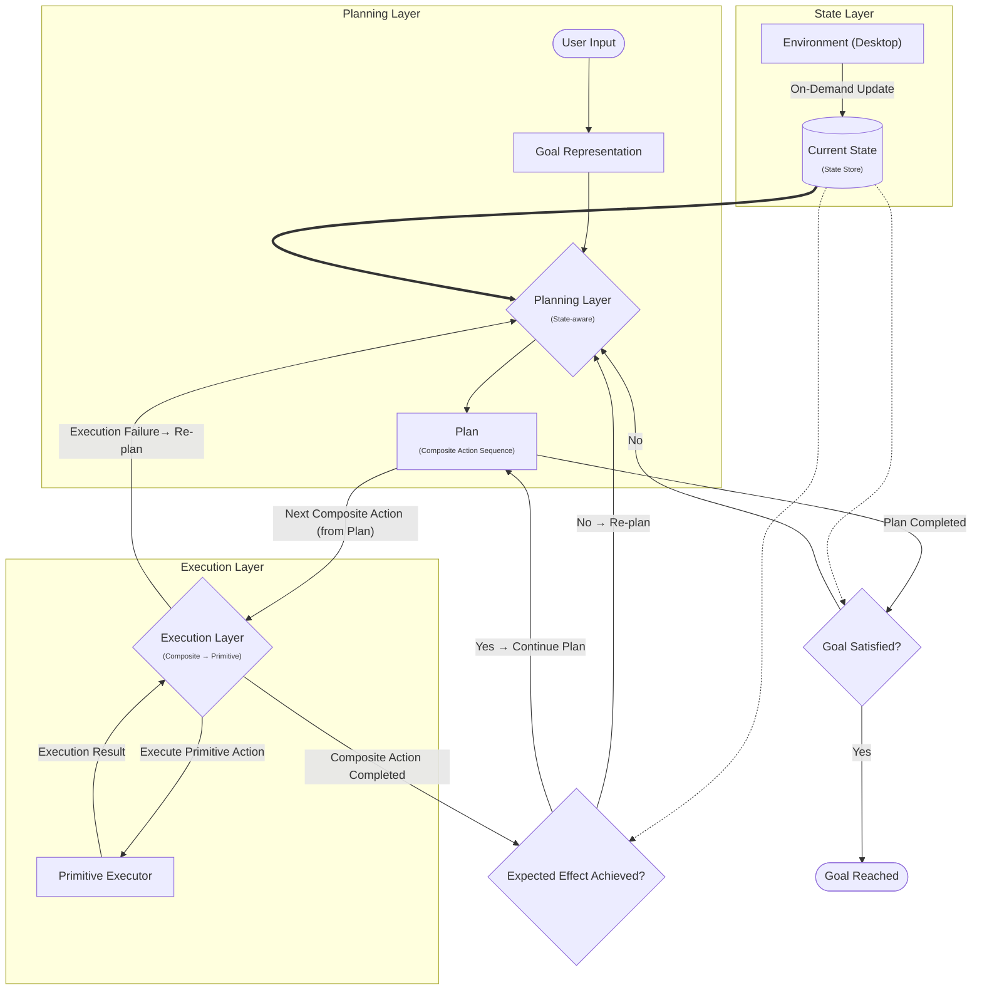

```mermaid
flowchart TD

    %% =======================
    %% STATE LAYER
    %% =======================
    subgraph State_Layer [State Layer]
        direction LR
        S["Environment (Desktop)"]
        X[("Current State<br/><span style='font-size:10px'>(State Store)</span>")]
        S -->|"On-Demand Update"| X
    end

    %% =======================
    %% STRATEGY LAYER
    %% =======================
    subgraph Strategy_Layer [Planning Layer]
        direction TB
        A([User Input]) --> B["Goal Representation"]
        B --> C{"Planning Layer<br/><span style='font-size:10px'>(State-aware)</span>"}
        C --> Y["Plan<br/><span style='font-size:10px'>(Composite Action Sequence)</span>"]
    end

    %% =======================
    %% EXECUTION LAYER
    %% =======================
    subgraph Execution_Layer [Execution Layer]
        direction TB
        G{"Execution Layer<br/><span style='font-size:10px'> (Composite → Primitive)</span> "}
        H["Primitive Executor"]

        G -->|"Execute Primitive Action"| H
        H -->|"Execution Result"| G

    end

    %% =======================
    %% CORE FLOW
    %% =======================
    X ==> C
    Y -->|"Next Composite Action (from Plan)"| G

    %% =======================
    %% VALIDATION & CONTROL
    %% =======================
    G -->|"Execution Failure→ Re-plan"| C
    G -->|"Composite Action Completed"| P{"Expected Effect Achieved?"}

    P -->|"No  → Re-plan"| C
    P -->|"Yes  → Continue Plan"| Y

    Y -->|"Plan Completed"| W{"Goal Satisfied?"}

    W -->|"No"| C
    W -->|"Yes"| J([Goal Reached])

    %% =======================
    %% STATE DEPENDENCIES
    %% =======================
    X -.-> P
    X -.-> W
```
