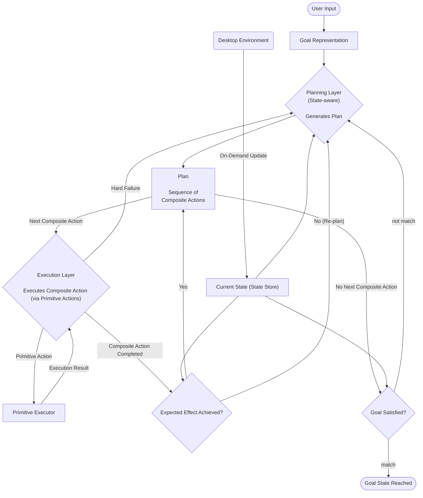

```mermaid
flowchart TD
    A([User Input]) --> B["Goal Representation"]
    B --> C{"Planning Layer
(State-aware)

    Generates Plan"}
    C --> Y["Plan

Sequence of
Composite Actions"]
    Y --Next Composite Action--> G{"Execution Layer

Executes Composite Action (via Primitive Actions)"}
    G --Primitive Action--> H["Primitive Executor"]
    H --Execution Result-->G
    G --Hard Failure--> C
    G --Composite Action Completed--> P{"Expected Effect Achieved?"}
    P --Yes--> Y
    P --No (Re-plan)--> C
    Y --No Next Composite Action---> W{"Goal Satisfied?"}
    W --match--> J([Goal State Reached])
    W--not match-->C

    %% INVISIBLE LINK TO LOWER THE POSITION
    Y ~~~ X

    X["Current State (State Store)"] --> C
    X -->W
    X --> P
    T("Desktop Environment") --On-Demand Update----> X
```
